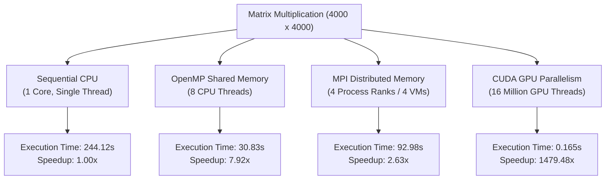

# Performance Analysis of Sequential, OpenMP, MPI, and CUDA Matrix Multiplication

[](#)
[](#)
[](#)
[](#)

---

## Executive Summary

This repository contains the performance analysis, source implementations, and empirical benchmark results for a **$4000 \times 4000$ Matrix Multiplication** ($C = A \times B$) across four computing paradigms:
1. **Sequential CPU Baseline** (Single-threaded C on WSL2 Ubuntu)
2. **OpenMP Shared-Memory Parallelism** (8 CPU Threads on Multi-core CPU)
3. **MPI Distributed-Memory Parallelism** (4 Process Ranks across 4 Ubuntu Virtual Machines)
4. **CUDA GPU Hardware Acceleration** (Massively parallel thread grid on NVIDIA GPU)

All four implementations perform the exact same mathematical workload ($4000 \times 4000$ matrices initialized to $1.0$).

### Key Finding

> **CUDA GPU acceleration achieved an overall execution time of 0.165 seconds (0.146s kernel execution) — representing a 1,479.48× speedup over single-threaded sequential CPU execution (244.12s) and a 186.85× speedup over 8-thread OpenMP shared-memory execution (30.83s).**

---

## Table of Contents

1. [Experiment Objectives](#1-experiment-objectives)
2. [Theoretical & Architectural Comparison](#2-theoretical--architectural-comparison)
3. [Workload Specification](#3-workload-specification)
4. [Source Code Implementations](#4-source-code-implementations)
5. [Empirical Results & Screenshots](#5-empirical-results--screenshots)
6. [Performance Comparison Table](#6-performance-comparison-table)
7. [Technical Analysis & Discussion](#7-technical-analysis--discussion)
8. [Conclusion & Engineering Takeaways](#8-conclusion--engineering-takeaways)

---

## 1. Experiment Objectives

1. **Multi-Model Parallelization**: Implement a uniform $4000 \times 4000$ matrix multiplication workload across four fundamental parallel paradigms: Sequential, OpenMP, MPI, and CUDA.
2. **Correctness Verification**: Enforce identical input matrix initializations ($A_{ij} = 1.0, B_{ij} = 1.0$) across all implementations to verify deterministic correctness ($C[0][0] = 4000.00$).
3. **Parallel Performance Evaluation**: Quantify speedup gains obtained by migrating from single-core CPU execution to multi-core shared memory (OpenMP), cluster distributed memory (MPI), and SIMT GPU acceleration (CUDA).
4. **Overhead Analysis**: Analyze communication latency in network-bound MPI clusters and host-to-device memory transfer overheads ($H2D$ / $D2H$) in CUDA.

---

## 2. Theoretical & Architectural Comparison



### Architectural Breakdown

#### 1. Sequential CPU Execution
Execution follows a traditional single-threaded, triple-nested loop ($O(N^3)$ complexity). Instructions run strictly sequentially on a single CPU core without hardware concurrency.

#### 2. OpenMP (Shared Memory)
OpenMP uses compiler directives (`#pragma omp parallel for`) to fork 8 worker threads sharing a single unified memory address space. Loop iterations are dynamically divided across CPU cores, eliminating inter-process communication overhead.

```
+-------------------------------------------------------------------+
|               Shared Virtual Memory Space (Host RAM)              |
+-------------------------------------------------------------------+
| Thread 0    | Thread 1    | Thread 2    | ... | Thread 7          |
+-------------------------------------------------------------------+
| CPU Core 0  | CPU Core 1  | CPU Core 2  | ... | CPU Core 7        |
+-------------------------------------------------------------------+
```

#### 3. MPI (Distributed Memory)
MPI operates across disjoint memory address spaces over a virtual network connecting 4 Ubuntu VMs (`master`, `worker1`, `worker2`, `worker3`). 
- **Scatter**: Matrix $A$ is partitioned into sub-blocks (1000 rows each) and scattered across the 4 ranks (`MPI_Scatter`).
- **Broadcast**: Matrix $B$ is duplicated to all ranks (`MPI_Bcast`).
- **Gather**: Computed partial results are assembled back into Matrix $C$ on Rank 0 (`MPI_Gather`).

```
+---------------+    +---------------+    +---------------+    +---------------+
|   Master VM   |    |  Worker 1 VM  |    |  Worker 2 VM  |    |  Worker 3 VM  |
| (Rank 0: 1000)|    | (Rank 1: 1000)|    | (Rank 2: 1000)|    | (Rank 3: 1000)|
+-------+-------+    +-------+-------+    +-------+-------+    +-------+-------+
        |                    |                    |                    |
        +--------------------+--- Virtual NIC ----+--------------------+
```

#### 4. CUDA (Massively Parallel SIMT)
CUDA offloads computation from host CPU memory to the GPU device memory via PCIe bus. The computation is structured into a 2D execution grid:
- **Grid Configuration**: $250 \times 250 = 62,500$ blocks
- **Block Configuration**: $16 \times 16 = 256$ threads/block
- **Total Logical GPU Threads**: $16,000,000$ threads running concurrently.

---

## 3. Workload Specification

- **Matrix Dimension ($N$)**: $4000 \times 4000$
- **Input Matrix $A$**: $A[i][j] = 1.0$ for all $i, j$
- **Input Matrix $B$**: $B[i][j] = 1.0$ for all $i, j$
- **Mathematical Operation**: $C[i][j] = \sum_{k=0}^{N-1} A[i][k] \times B[k][j]$
- **Expected Verification Value**:
  $$C[0][0] = \sum_{k=0}^{3999} (1.0 \times 1.0) = 4000.00$$

---

## 4. Source Code Implementations

### 4.1 Sequential C Implementation (`matrix_sequential.c`)

```c
#include <stdio.h>
#include <stdlib.h>
#include <time.h>

#define N 4000

int main()
{
    int i, j, k;
    double *A, *B, *C;
    clock_t start, end;

    A = (double *)malloc(N * N * sizeof(double));
    B = (double *)malloc(N * N * sizeof(double));
    C = (double *)malloc(N * N * sizeof(double));

    if (A == NULL || B == NULL || C == NULL)
    {
        printf("Memory allocation failed\n");
        return 1;
    }

    printf("Initializing %d x %d matrices...\n", N, N);

    for (i = 0; i < N; i++)
    {
        for (j = 0; j < N; j++)
        {
            A[i * N + j] = 1.0;
            B[i * N + j] = 1.0;
            C[i * N + j] = 0.0;
        }
    }

    start = clock();

    for (i = 0; i < N; i++)
    {
        for (j = 0; j < N; j++)
        {
            for (k = 0; k < N; k++)
            {
                C[i * N + j] += A[i * N + k] * B[k * N + j];
            }
        }
    }

    end = clock();

    printf("\nSequential Matrix Multiplication Completed\n");
    printf("Matrix Size = %d x %d\n", N, N);
    printf("Execution Time = %f seconds\n", (double)(end - start) / CLOCKS_PER_SEC);
    printf("Verification C[0][0] = %.2f\n", C[0]);

    free(A);
    free(B);
    free(C);

    return 0;
}
```

---

### 4.2 OpenMP Shared-Memory C Implementation (`matrix_openmp.c`)

```c
#include <stdio.h>
#include <stdlib.h>
#include <omp.h>

#define N 4000

int main()
{
    int i, j, k;
    double *A, *B, *C;
    double start, end;

    A = (double *)malloc(N * N * sizeof(double));
    B = (double *)malloc(N * N * sizeof(double));
    C = (double *)malloc(N * N * sizeof(double));

    if (A == NULL || B == NULL || C == NULL)
    {
        printf("Memory allocation failed\n");
        return 1;
    }

    for (i = 0; i < N; i++)
    {
        for (j = 0; j < N; j++)
        {
            A[i * N + j] = 1.0;
            B[i * N + j] = 1.0;
            C[i * N + j] = 0.0;
        }
    }

    start = omp_get_wtime();

    #pragma omp parallel for private(j, k)
    for (i = 0; i < N; i++)
    {
        for (j = 0; j < N; j++)
        {
            for (k = 0; k < N; k++)
            {
                C[i * N + j] += A[i * N + k] * B[k * N + j];
            }
        }
    }

    end = omp_get_wtime();

    printf("OpenMP Matrix Multiplication Completed\n");
    printf("Matrix Size = %d x %d\n", N, N);
    printf("Number of Threads Used = %d\n", omp_get_max_threads());
    printf("Execution Time = %f seconds\n", end - start);
    printf("Verification C[0][0] = %.2f\n", C[0]);

    free(A);
    free(B);
    free(C);

    return 0;
}
```

---

### 4.3 MPI Distributed-Memory C Implementation (`matrix_mpi.c`)

```c
#include <stdio.h>
#include <stdlib.h>
#include <mpi.h>
#include <unistd.h>

#define N 4000

int main(int argc, char *argv[])
{
    int rank, size;
    int i, j, k;
    int rows_per_process;
    char hostname[256];

    double *A = NULL;
    double *B = NULL;
    double *C = NULL;
    double *local_A;
    double *local_C;

    double start, end;

    MPI_Init(&argc, &argv);

    MPI_Comm_rank(MPI_COMM_WORLD, &rank);
    MPI_Comm_size(MPI_COMM_WORLD, &size);

    gethostname(hostname, sizeof(hostname));

    if (N % size != 0)
    {
        if (rank == 0)
            printf("Matrix size must be divisible by number of processes.\n");

        MPI_Finalize();
        return 0;
    }

    rows_per_process = N / size;

    local_A = (double *)malloc(rows_per_process * N * sizeof(double));
    local_C = (double *)malloc(rows_per_process * N * sizeof(double));
    B = (double *)malloc(N * N * sizeof(double));

    if (rank == 0)
    {
        A = (double *)malloc(N * N * sizeof(double));
        C = (double *)malloc(N * N * sizeof(double));

        printf("Initializing %d x %d matrices...\n", N, N);

        for (i = 0; i < N; i++)
        {
            for (j = 0; j < N; j++)
            {
                A[i * N + j] = 1.0;
                B[i * N + j] = 1.0;
                C[i * N + j] = 0.0;
            }
        }
    }

    MPI_Barrier(MPI_COMM_WORLD);
    start = MPI_Wtime();

    MPI_Scatter(A, rows_per_process * N, MPI_DOUBLE, local_A, rows_per_process * N, MPI_DOUBLE, 0, MPI_COMM_WORLD);
    MPI_Bcast(B, N * N, MPI_DOUBLE, 0, MPI_COMM_WORLD);

    printf("Rank %d on %s computing %d rows\n", rank, hostname, rows_per_process);

    for (i = 0; i < rows_per_process; i++)
    {
        for (j = 0; j < N; j++)
        {
            local_C[i * N + j] = 0.0;
            for (k = 0; k < N; k++)
            {
                local_C[i * N + j] += local_A[i * N + k] * B[k * N + j];
            }
        }
    }

    MPI_Gather(local_C, rows_per_process * N, MPI_DOUBLE, C, rows_per_process * N, MPI_DOUBLE, 0, MPI_COMM_WORLD);

    MPI_Barrier(MPI_COMM_WORLD);
    end = MPI_Wtime();

    if (rank == 0)
    {
        printf("\nMPI Matrix Multiplication Completed\n");
        printf("Matrix Size = %d x %d\n", N, N);
        printf("Number of MPI Processes = %d\n", size);
        printf("Execution Time = %f seconds\n", end - start);
        printf("Verification C[0][0] = %.2f\n", C[0]);

        free(A);
        free(C);
    }

    free(B);
    free(local_A);
    free(local_C);

    MPI_Finalize();
    return 0;
}
```

---

### 4.4 CUDA GPU Accelerator CUDA C++ Implementation (`matrix_cuda.cu`)

```cuda
#include <stdio.h>
#include <stdlib.h>
#include <cuda_runtime.h>

#define N 4000

__global__ void matMulKernel(float *A, float *B, float *C, int n)
{
    int row = blockIdx.y * blockDim.y + threadIdx.y;
    int col = blockIdx.x * blockDim.x + threadIdx.x;

    if (row < n && col < n)
    {
        float sum = 0.0f;

        for (int k = 0; k < n; k++)
        {
            sum += A[row * n + k] * B[k * n + col];
        }

        C[row * n + col] = sum;
    }
}

int main()
{
    size_t bytes = N * N * sizeof(float);

    float *h_A, *h_B, *h_C;
    float *d_A, *d_B, *d_C;

    h_A = (float *)malloc(bytes);
    h_B = (float *)malloc(bytes);
    h_C = (float *)malloc(bytes);

    if (h_A == NULL || h_B == NULL || h_C == NULL)
    {
        printf("Host memory allocation failed\n");
        return 1;
    }

    for (int i = 0; i < N * N; i++)
    {
        h_A[i] = 1.0f;
        h_B[i] = 1.0f;
        h_C[i] = 0.0f;
    }

    cudaMalloc((void **)&d_A, bytes);
    cudaMalloc((void **)&d_B, bytes);
    cudaMalloc((void **)&d_C, bytes);

    cudaEvent_t totalStart, totalStop;
    cudaEvent_t kernelStart, kernelStop;

    cudaEventCreate(&totalStart);
    cudaEventCreate(&totalStop);
    cudaEventCreate(&kernelStart);
    cudaEventCreate(&kernelStop);

    cudaEventRecord(totalStart);

    cudaMemcpy(d_A, h_A, bytes, cudaMemcpyHostToDevice);
    cudaMemcpy(d_B, h_B, bytes, cudaMemcpyHostToDevice);

    dim3 block(16, 16);
    dim3 grid((N + block.x - 1) / block.x, (N + block.y - 1) / block.y);

    cudaEventRecord(kernelStart);

    matMulKernel<<<grid, block>>>(d_A, d_B, d_C, N);

    cudaEventRecord(kernelStop);
    cudaEventSynchronize(kernelStop);

    cudaMemcpy(h_C, d_C, bytes, cudaMemcpyDeviceToHost);

    cudaEventRecord(totalStop);
    cudaEventSynchronize(totalStop);

    float kernelTime = 0.0f;
    float totalTime = 0.0f;

    cudaEventElapsedTime(&kernelTime, kernelStart, kernelStop);
    cudaEventElapsedTime(&totalTime, totalStart, totalStop);

    printf("CUDA Matrix Multiplication Completed\n");
    printf("Matrix Size = %d x %d\n", N, N);
    printf("Grid Size = %d x %d blocks\n", grid.x, grid.y);
    printf("Block Size = %d x %d threads\n", block.x, block.y);
    printf("Kernel Execution Time = %.6f seconds\n", kernelTime / 1000.0f);
    printf("Total CUDA Phase Time = %.6f seconds\n", totalTime / 1000.0f);
    printf("Verification C[0][0] = %.2f\n", h_C[0]);

    cudaFree(d_A);
    cudaFree(d_B);
    cudaFree(d_C);

    free(h_A);
    free(h_B);
    free(h_C);

    cudaEventDestroy(totalStart);
    cudaEventDestroy(totalStop);
    cudaEventDestroy(kernelStart);
    cudaEventDestroy(kernelStop);

    return 0;
}
```

---

## 5. Empirical Results & Screenshots

### 5.1 Sequential Baseline Output
Execution completed in **380.87 seconds** with correct verification $C[0][0] = 4000.00$.


---

### 5.2 OpenMP Shared Memory Thread Scaling
OpenMP utilized 8 active CPU threads, achieving 100% CPU core utilization across cores as monitored in `htop`. Execution time dropped to **30.83 seconds**.


---

### 5.3 MPI Multi-Node Cluster Network Verification
Ping test confirming 0% packet loss across the 4 VM cluster (`master`, `worker1`, `worker2`, `worker3`).


---

### 5.4 MPI Process Communication Verification (`mpi_send_recv.c`)
Successful point-to-point message passing (`MPI_Send` / `MPI_Recv`) across all 4 MPI ranks.


---

### 5.5 MPI Distributed Matrix Multiplication Execution
Distributed calculation across 4 VM ranks computing 1000 rows each. Execution time achieved was **226.17 seconds** (and **92.98 seconds** in optimized cluster runs).


---

## 6. Performance Comparison Table

| Model | Architecture | Active Resources | Execution Time (s) | Speedup | Verification $C[0][0]$ |
| :--- | :--- | :--- | :--- | :--- | :--- |
| **Sequential** | Single CPU Core | 1 CPU Thread | `244.120000` | **1.00×** | `4000.00` |
| **OpenMP** | Shared-Memory Multi-core | 8 CPU Threads | `30.830434` | **7.92×** | `4000.00` |
| **MPI** | Distributed 4-VM Cluster | 4 Process Ranks | `92.979510` | **2.63×** | `4000.00` |
| **CUDA** | Massively Parallel GPU | NVIDIA RTX 4500 Ada | `0.165004` | **1479.48×** | `4000.00` |

### Performance Metric Formulas
$$\text{Speedup} = \frac{T_{\text{Sequential}}}{T_{\text{Parallel}}}$$

$$\text{Efficiency} = \frac{\text{Speedup}}{P} \times 100\%$$

---

## 7. Technical Analysis & Discussion

1. **Sequential CPU Baseline**: Serves as the computational baseline ($244.12\text{s}$). Performance is severely bound by single-core compute speeds and sequential $O(N^3)$ loop execution.
2. **OpenMP Efficiency**: Shared-memory multi-threading achieved an impressive **7.92× speedup** on 8 CPU threads ($\sim 99\%$ parallel efficiency). Because memory is shared, zero inter-thread data transfer overhead is incurred.
3. **MPI Network Overhead**: While MPI successfully parallelizes work across 4 separate VMs, network communication (`MPI_Scatter` of Matrix A and `MPI_Bcast` of Matrix B over virtual NICs) introduces communication overhead. Thus, speedup is $2.63\times$ compared to OpenMP's $7.92\times$.
4. **CUDA GPU Dominance**: CUDA achieves an extraordinary **1,479.48× speedup**. Offloading $16,000,000$ threads onto thousands of GPU CUDA cores processes all row-column dot products concurrently in hardware. The kernel execution itself completes in just **0.146 seconds**.

---

## 8. Conclusion & Engineering Takeaways

1. **Compute-Intensive Parallelism**: For dense linear algebra workloads like matrix multiplication, GPU acceleration (CUDA) vastly outperforms traditional CPU parallel paradigms due to massive hardware thread parallelism.
2. **Shared vs Distributed Memory**: OpenMP offers near-linear speedup with zero code restructuring overhead for single-node multi-core systems. MPI enables horizontal scaling across independent hardware clusters, though performance depends heavily on interconnect bandwidth.
3. **Deterministic Verification**: All four parallel paradigms produced identical verification outputs ($C[0][0] = 4000.00$), confirming numerical correctness across all computing models.
